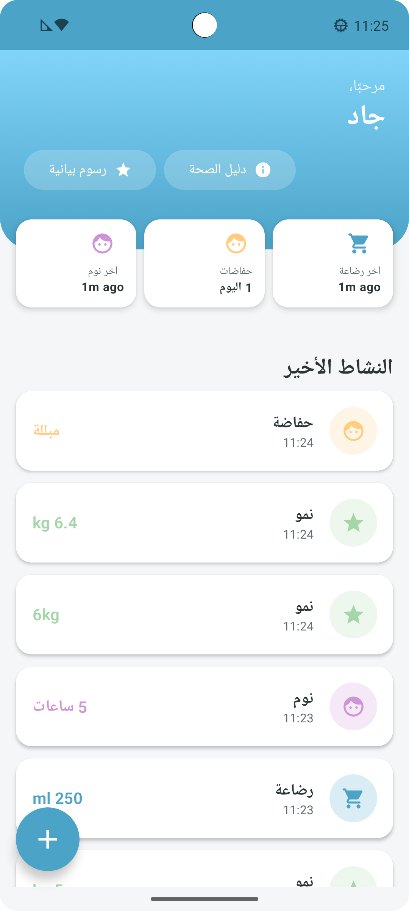
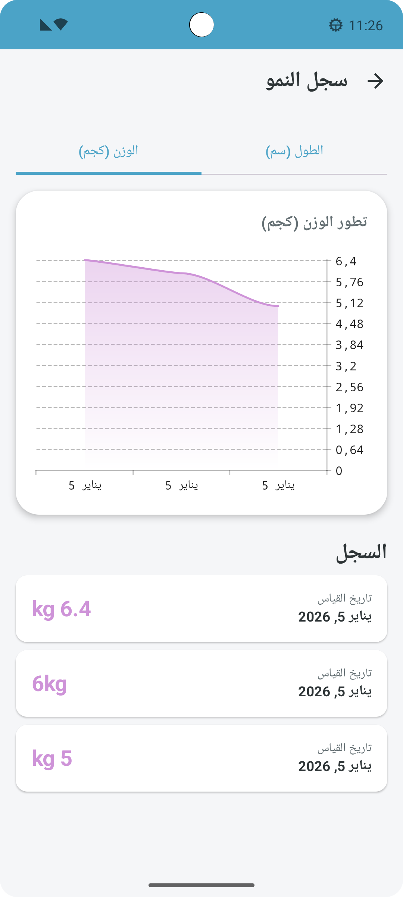
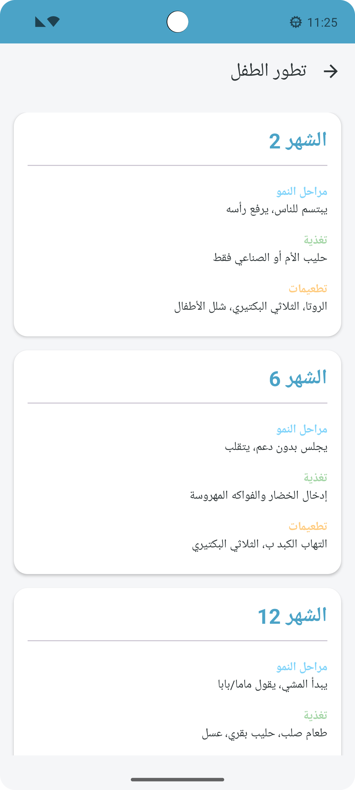
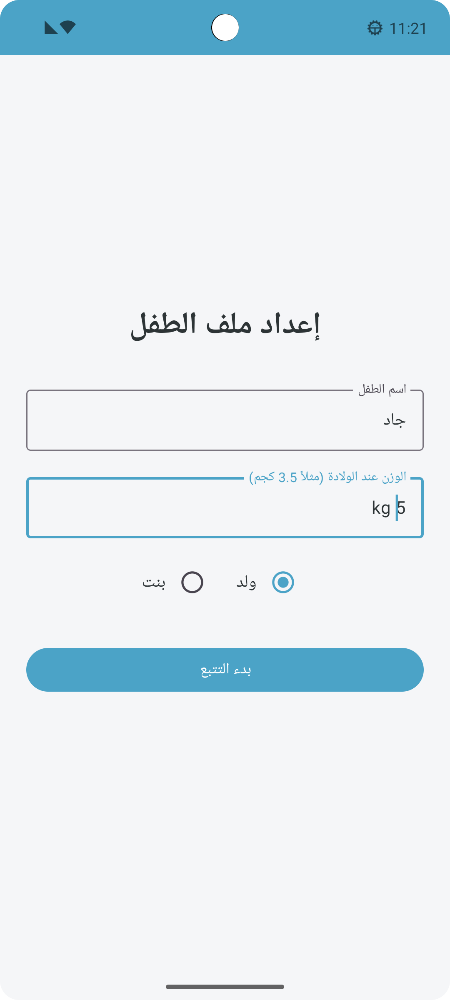

# BabyGrowthTracker 👶📊

## Description du Projet
BabyGrowthTracker est une application mobile Android native conçue pour aider les parents à suivre le développement de leur nouveau-né. L'application permet d'enregistrer les activités quotidiennes (repas, sommeil, changements de couches), de suivre la courbe de croissance (poids/taille) et de consulter un guide de santé adapté à l'âge de l'enfant.

L'application est construite avec une architecture **Offline-First**, garantissant que les parents peuvent accéder à leurs données et en ajouter de nouvelles même sans connexion internet. La synchronisation avec le Cloud se fait automatiquement en arrière-plan.

## 📱 Fonctionnalités Principales

*   **Suivi d'activités :** Chronomètres pour l'allaitement et le sommeil, journalisation des couches.
*   **Graphiques de Croissance :** Visualisation des courbes de poids et de taille (Bibliothèque Vico).
*   **Guide de Santé :** Conseils de développement, nutrition et vaccination basés sur l'âge (Support multilingue).
*   **Synchronisation Cloud :** Sauvegarde des données via Firebase Firestore pour accès multi-appareils.
*   **Support Multilingue :** Anglais, Français, Arabe (avec support RTL).
*   **Mode Invité & Authentification :** Connexion via Google ou utilisation anonyme.

## 🛠 Technologies Utilisées

### Partie Front-End (Interface & Logique UI)
*   **Langage :** Kotlin
*   **UI Toolkit :** Jetpack Compose (Material Design 3)
*   **Navigation :** Jetpack Navigation Compose
*   **Graphiques :** Vico Charts
*   **Injection de Dépendances :** Hilt (Dagger)
*   **Architecture :** MVVM (Model-View-ViewModel) + Clean Architecture

### Partie Back-End (Données & Synchro)
*   **Base de données locale :** Room Database (SQLite) pour la persistance locale (Offline access).
*   **Base de données distante (BaaS) :** Firebase Firestore (NoSQL).
*   **Authentification :** Firebase Auth (Google Sign-In, Anonymous).
*   **Tâches de fond :** WorkManager (pour la synchronisation des logs et les rappels).

## 🏗 Architecture du Projet

Le projet suit les principes de la **Clean Architecture** :

1.  **Domain Layer :** Contient les modèles de données (`LogEntry`, `BabyEntity`) et les interfaces de Repository.
2.  **Data Layer :** Implémentation des Repositories, gestion de la base de données locale (Room) et distante (Firebase), et synchronisation (`SyncWorker`).
3.  **UI Layer :** Écrans Composable (`DashboardScreen`, `GrowthScreen`) et ViewModels (`DashboardViewModel`).

## 📸 Démonstration

*(Ajoutez ici vos captures d'écran - voir dossier /screenshots)*

| Dashboard | Graphiques | Guide Santé | Profil |
|:---:|:---:|:---:|:---:|
|  |  |  |  |

## 🚀 Installation et Lancement

1.  Cloner le dépôt :
    ```bash
    git clone https://github.com/VOTRE_NOM_UTILISATEUR/BabyGrowthTracker.git
    ```
2.  Ouvrir le projet dans **Android Studio Ladybug (ou version plus récente)**.
3.  Synchroniser les fichiers Gradle.
4.  Ajouter votre fichier `google-services.json` dans le dossier `/app` (nécessaire pour Firebase).
5.  Lancer l'application sur un émulateur ou un appareil physique (Min SDK : 26).

## Auteur
Réalisé dans le cadre du projet de développement mobile.
